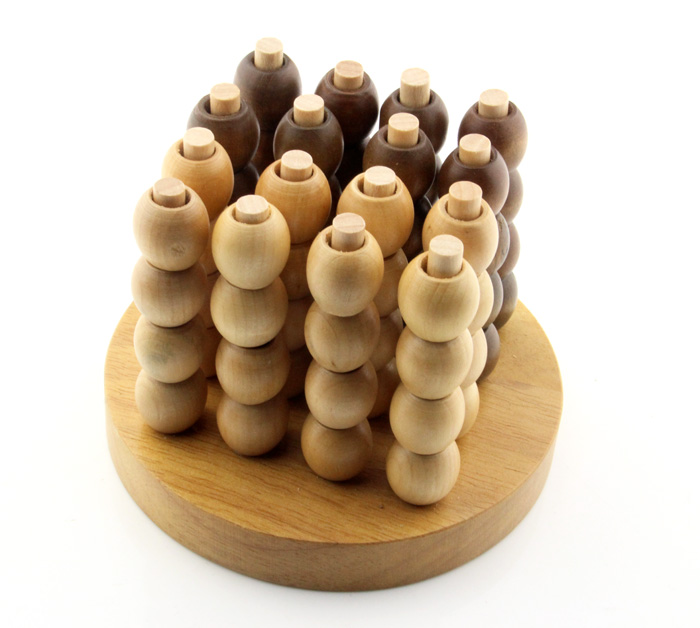

# 3D Connect Four AI

This project implements several computer players that can play 3D Connect Four.



Reference players: 

- a random player
- a greedy player that maximizes its own maximum line length
- a [minimax](https://en.wikipedia.org/wiki/Minimax) player based on line length
- a [MCTS](https://en.wikipedia.org/wiki/Monte_Carlo_tree_search) player that uses random playouts

Model based players: 
- an [AlphaGo Zero](https://en.wikipedia.org/wiki/AlphaGo_Zero) player that uses a policy neural network

The best player is the AlphaGo Zero player and the command-line util focusses on interacting and improving that. 

## Play iteractive game against `AlphaConnectPlayer`

You can use the command-line to play an interactive game against the current best AlphaGo Zero player.  This shows the 
current board state as four horizontal slices and uses hexadecimal numbers to represent actions. Enter a number between
`0` and `f` to drop a stone. 

After you have played the first stone, `AlphaConnectPlayer` will take 15 seconds to make it's move. 

```
$ export PYTHONPATH=connect-four
$ python -m connect-four play models/000170.h5

. . . .
. . . .
. . . .
. . . .

. . . .
. . . .
. . . .
. . . .

. . . .
. . . .
. . . .
. . . .

_ _ _ _
_ _ _ _
_ _ _ _
_ _ _ _

Possible actions:
0 4 8 c
1 5 9 d
2 6 a e
3 7 b f
Choose your action: 
```

## Continuously generate games with self-play

To continuously generate new self-play games, in parallel, using the newest neural network model, run:

```
$ python -m connect-four simulate-continuously models/ data/
Written game to: data/000172/20190923_140243_836785.json
Written game to: data/000172/20190923_140252_434749.json
```

## Continuously optimize neural network

The self-play games can be used to predict the outcome and best actions for arbitrary states during those games. It uses 
the outcome of MCTS searches during the game to predict which actions should be played, and it uses the final outcome 
of the game (i.e. win, lose or draw) to predict its value.

Note: optimizing the neural network can go very fast, especially if there are only a few self-play games. To give the 
simulation process more time for simulating new games with the latest model, this process waits for 30 minutes between 
each consequtive optimization. 

To continuously optimize a policy and value neural network, run: 

```
$ python -m connect-four optimize-continuously data/ models/
Model: "model"
__________________________________________________________________________________________________
Layer (type)                    Output Shape         Param #     Connected to                     
==================================================================================================
input_1 (InputLayer)            [(None, 4, 4, 4, 13) 0                                            
__________________________________________________________________________________________________
...
__________________________________________________________________________________________________

Using game files from data/000000/20190825_224003_643756.json to data/000172/20190903_074350_110901.json
100%|██████████| 100/100 [00:01<00:00, 99.90it/s]
Train on 560 samples, validate on 240 samples
2019-09-23 14:16:44.954929: I tensorflow/core/platform/cpu_feature_guard.cc:142] Your CPU supports instructions that this TensorFlow binary was not compiled to use: AVX2 FMA
Epoch 1/100
560/560 [==============================] - 4s 7ms/sample - loss: 3.8670 - softmax_loss: 2.7794 - dense_3_loss: 1.0636 - softmax_categorical_accuracy: 0.0607 - dense_3_mean_absolute_error: 0.9964 - val_loss: 3.7915 - val_softmax_loss: 2.7718 - val_dense_3_loss: 0.9931 - val_softmax_categorical_accuracy: 0.0708 - val_dense_3_mean_absolute_error: 0.9936
Epoch 2/100
560/560 [==============================] - 0s 879us/sample - loss: 3.7463 - softmax_loss: 2.7681 - dense_3_loss: 0.9620 - softmax_categorical_accuracy: 0.0714 - dense_3_mean_absolute_error: 0.9486 - val_loss: 3.7870 - val_softmax_loss: 2.7707 - val_dense_3_loss: 0.9926 - val_softmax_categorical_accuracy: 0.0750 - val_dense_3_mean_absolute_error: 0.9907
Epoch 3/100
...
``` 

## Continuously generate tournament games between all players

A tournament is usefull to determine the best player. In a tournament all types of players are randomly paired and play 
a game. Unlike with self-play games, the randomization of `AlphaGoConnect` player is disabled such that it will always 
performs the best move. 

```
$ python -m connect-four tournament-continously tournament-data/ models/
Written game to: tournament-data/20190923_140243_836785.json
Written game to: tournamet-data/20190923_140252_434749.json
Written game to: tournamet-data/20190923_140313_240510.json
...
```


## Compute Bayesian Elo rating

The tournament games can be used to compute the [Elo rating](https://nl.wikipedia.org/wiki/Elo-rating) of each player. 
This orders the players based on their mutual winning odds. 

This uses (Stan)[https://mc-stan.org] to compute a 
(Bayesian version of the Elo rating)[https://www.remi-coulom.fr/Bayesian-Elo/].  

```
$ python -m connect-four tournament-elo tournament-data/
Gradient evaluation took 0.000892 seconds
1000 transitions using 10 leapfrog steps per transition would take 8.92 seconds.
Adjust your expectations accordingly!

Iteration:    1 / 2000 [  0%]  (Warmup)
...
Iteration: 2000 / 2000 [100%]  (Sampling)

 Elapsed Time: 3.94725 seconds (Warm-up)
               2.22654 seconds (Sampling)
               6.17379 seconds (Total)

Advantage of starting player: 0.33 (>0.21, <0.46)
 games    wins  losses  |   lower  median   upper  |    best  |  player
   387     360      27  |    2.46    3.01    3.57  |    100%  |  AlphaConnectPlayer(model_path='/Users/pieter/Documents/Projects/connect-four/models/000170.h5', exploration=1.0, start_temperature=1.0, time_budget=None, search_budget=1600, self_play=False, batch_size=16)
   132     100      32  |    1.54    2.13    2.73  |      0%  |  AlphaConnectPlayer(model_path='/Users/pieter/Documents/Projects/connect-four/models/000150.h5', exploration=1.0, start_temperature=1.0, time_budget=None, search_budget=1600, self_play=False, batch_size=16)
   218     168      50  |    1.36    1.89    2.42  |      0%  |  AlphaConnectPlayer(model_path='/Users/pieter/Documents/Projects/connect-four/models/000110.h5', exploration=1.0, start_temperature=1.0, time_budget=None, search_budget=1600, self_play=False, batch_size=16)
   194     142      52  |    1.32    1.85    2.39  |      0%  |  AlphaConnectPlayer(model_path='/Users/pieter/Documents/Projects/connect-four/models/000120.h5', exploration=1.0, start_temperature=1.0, time_budget=None, search_budget=1600, self_play=False, batch_size=16)
   161     120      41  |    1.27    1.81    2.38  |      0%  |  AlphaConnectPlayer(model_path='/Users/pieter/Documents/Projects/connect-four/models/000160.h5', exploration=1.0, start_temperature=1.0, time_budget=None, search_budget=1600, self_play=False, batch_size=16)
   170     125      45  |    1.22    1.75    2.31  |      0%  |  AlphaConnectPlayer(model_path='/Users/pieter/Documents/Projects/connect-four/models/000130.h5', exploration=1.0, start_temperature=1.0, time_budget=None, search_budget=1600, self_play=False, batch_size=16)
   160     116      44  |    1.05    1.60    2.17  |      0%  |  AlphaConnectPlayer(model_path='/Users/pieter/Documents/Projects/connect-four/models/000140.h5', exploration=1.0, start_temperature=1.0, time_budget=None, search_budget=1600, self_play=False, batch_size=16)
   218     151      67  |    0.98    1.47    1.96  |      0%  |  AlphaConnectPlayer(model_path='/Users/pieter/Documents/Projects/connect-four/models/000100.h5', exploration=1.0, start_temperature=1.0, time_budget=None, search_budget=1600, self_play=False, batch_size=16)
   131      82      49  |    0.76    1.35    1.93  |      0%  |  AlphaConnectPlayer(model_path='/Users/pieter/Documents/Projects/connect-four/models/000090.h5', exploration=1.0, start_temperature=1.0, time_budget=None, search_budget=1600, self_play=False, batch_size=16)
   150      92      58  |    0.50    1.07    1.63  |      0%  |  MiniMaxPlayer(depth=2)
   141      84      57  |    0.37    0.94    1.48  |      0%  |  AlphaConnectPlayer(model_path='/Users/pieter/Documents/Projects/connect-four/models/000060.h5', exploration=1.0, start_temperature=1.0, time_budget=None, search_budget=1600, self_play=False, batch_size=16)
   151      85      66  |    0.31    0.87    1.42  |      0%  |  AlphaConnectPlayer(model_path='/Users/pieter/Documents/Projects/connect-four/models/000070.h5', exploration=1.0, start_temperature=1.0, time_budget=None, search_budget=1600, self_play=False, batch_size=16)
   146      83      63  |    0.29    0.82    1.40  |      0%  |  AlphaConnectPlayer(model_path='/Users/pieter/Documents/Projects/connect-four/models/000080.h5', exploration=1.0, start_temperature=1.0, time_budget=None, search_budget=1600, self_play=False, batch_size=16)
   158      82      76  |    0.00    0.56    1.11  |      0%  |  MiniMaxPlayer(depth=3)
   137      66      71  |   -0.11    0.45    0.99  |      0%  |  AlphaConnectPlayer(model_path='/Users/pieter/Documents/Projects/connect-four/models/000050.h5', exploration=1.0, start_temperature=1.0, time_budget=None, search_budget=1600, self_play=False, batch_size=16)
   141      64      77  |   -0.42    0.18    0.69  |      0%  |  MiniMaxPlayer(depth=1)
   147      59      88  |   -0.87   -0.26    0.31  |      0%  |  AlphaConnectPlayer(model_path='/Users/pieter/Documents/Projects/connect-four/models/000040.h5', exploration=1.0, start_temperature=1.0, time_budget=None, search_budget=1600, self_play=False, batch_size=16)
   141      54      87  |   -1.16   -0.57    0.02  |      0%  |  AlphaConnectPlayer(model_path='/Users/pieter/Documents/Projects/connect-four/models/000030.h5', exploration=1.0, start_temperature=1.0, time_budget=None, search_budget=1600, self_play=False, batch_size=16)
   146      46     100  |   -1.44   -0.85   -0.29  |      0%  |  AlphaConnectPlayer(model_path='/Users/pieter/Documents/Projects/connect-four/models/000010.h5', exploration=1.0, start_temperature=1.0, time_budget=None, search_budget=1600, self_play=False, batch_size=16)
   136      36     100  |   -1.81   -1.21   -0.62  |      0%  |  AlphaConnectPlayer(model_path='/Users/pieter/Documents/Projects/connect-four/models/000020.h5', exploration=1.0, start_temperature=1.0, time_budget=None, search_budget=1600, self_play=False, batch_size=16)
   162      41     121  |   -1.90   -1.34   -0.73  |      0%  |  MonteCarloPlayer(exploration=1.000, budget=6400)
   145      35     110  |   -1.98   -1.38   -0.78  |      0%  |  GreedyPlayer()
   136      30     106  |   -2.07   -1.46   -0.85  |      0%  |  MonteCarloPlayer(exploration=1.000, budget=3200)
   136      19     117  |   -2.76   -2.06   -1.42  |      0%  |  AlphaConnectPlayer(model_path='/Users/pieter/Documents/Projects/connect-four/models/000000.h5', exploration=1.0, start_temperature=1.0, time_budget=None, search_budget=1600, self_play=False, batch_size=16)
   140      14     126  |   -3.30   -2.57   -1.89  |      0%  |  MonteCarloPlayer(exploration=1.000, budget=1600)
   156      14     142  |   -3.51   -2.82   -2.12  |      0%  |  MonteCarloPlayer(exploration=1.000, budget=800)
   143       8     135  |   -3.98   -3.15   -2.37  |      0%  |  MonteCarloPlayer(exploration=1.000, budget=400)
   132       0     132  |   -5.18   -4.16   -3.22  |      0%  |  RandomPlayer()
```

Note that these Elo ratings use a different intercept (0 instead of 1000) and scale (1 instead of 400) compared to
normal Elo ratings. 

Also note that `AlphaConnectPlayer` with the model `000170.h5` (included in this git project) is the best player. And
that (luckily) the `RandomPlayer` is the worst. 
